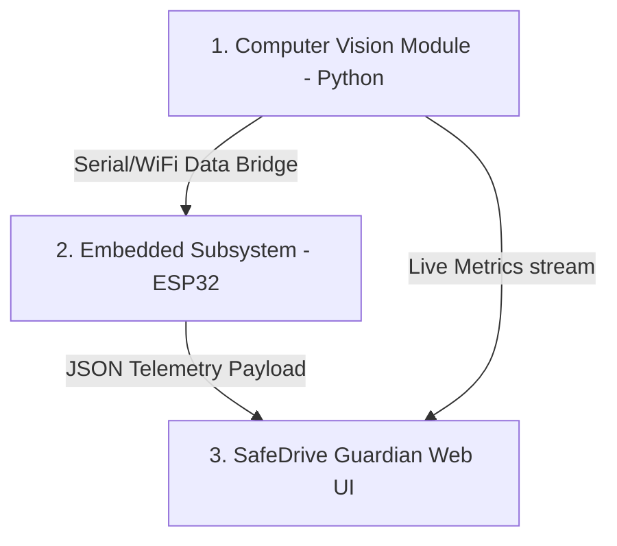

# Smart Real-Time Driver State Monitoring and Emergency Detection System

An integrated, end-to-end safety solution designed to monitor driver attentiveness, detect fatigue and distractions, evaluate vehicle crashes, and automate emergency SOS alerts. Developed with a high-fidelity Computer Vision module, an ESP32 Embedded System state machine, and a modern Web Analytics Dashboard.

---

## Live Deployments & Demos

* 📟 **Live Embedded Hardware Simulation (ESP32)**: [Wokwi Simulation](https://wokwi.com/projects/461791596566640641)
* 🌐 **Live Analytics & Monitoring Web Application**: [SafeDrive Guardian Dashboard](https://safe-dirve-guardian.vercel.app/)

---

## System Architecture & Connections

The system is organized into three core technical modules that operate in sync:

1. **Computer Vision Subsystem (`driver_state_cv`)**:
   - Analyzes real-time video frames using **MediaPipe Face Mesh** and **OpenCV**.
   - Computes physiological metrics: Eye Aspect Ratio (**EAR**), Mouth Aspect Ratio (**MAR**), **PERCLOS** (percentage of eye closure time), blink rate, yawning triggers, and head posture yaw/pitch/roll.
   - Calculates a consolidated **Fatigue Score** ranging from `0` to `100` and stream-logs telemetry.

2. **Embedded Hardware Subsystem (`emergency_detection_embedded`)**:
   - Micro-controller logic implemented on an **ESP32** (simulated on Wokwi).
   - Recieves the Fatigue Score from the CV module (mapped to a slide potentiometer for simulation purposes) and combines it with MPU6050 accelerometer/gyroscope reading for collision detection.
   - Updates hardware outputs based on a 5-stage state machine: **NORMAL**, **WARNING**, **ALARM**, **EMERGENCY**, and **MUTED**.
   - Drives active status LEDs, beeps a piezo Buzzer, prints parameters on an LCD display, and fires AT command routines via a simulated **GSM Modem** to dispatch coordinates and alert details during accidents or un-remedied driver unconsciousness.

3. **SafeDrive Guardian Frontend Web UI (`driver-monitoring-ui`)**:
   - Built on **React**, **Vite**, **TypeScript**, and **Tailwind CSS**.
   - Serves as an fleet monitoring dashboard displaying real-time KPI metrics, vehicle mapping ( Addis Ababa GPS simulation), live video telemetry simulations, and incident event logs.
   - Provides scenario control triggers to test system actions manually.

---

## Project Directory Map

This repository is split into the following subfolders:

### 📂 [`driver_state_cv`](./driver_state_cv)
* **Description**: Python CV logic containing face detection, landmark processing, and fatigue calculation routines.
* **Key Files**: `main.py` (core frame loop & math), `config.py` (threshold constants).

### 📂 [`emergency_detection_embedded`](./emergency_detection_embedded)
* **Description**: ESP32 C++ firmware code and circuit layout diagrams.
* **Key Files**: `sketch.ino` (state machine logic), `diagram.json` (Wokwi component layout).
* **Live Demo Link**: [Wokwi Embedded Simulation](https://wokwi.com/projects/461791596566640641)

### 📂 [`driver-monitoring-ui`](./driver-monitoring-ui)
* **Description**: Frontend SPA for fleet operators to track and analyze telemetry.
* **Key Files**: `src/` (components and hooks), `tailwind.config.js` (theme), `package.json`.
* **Live Demo Link**: [Vercel Web App](https://safe-dirve-guardian.vercel.app/)

### 📂 [`Project Proposal & Report Docs`](./Project%20Proposal%20&%20Report%20Docs)
* **Description**: Academic records, proposal papers, progress briefs, and system verification reports outlining the underlying equations and testing methodologies.

---

## Getting Started

Refer to the individual `README.md` files within each folder for precise instructions on how to install dependencies and run the modules locally.
